# Interactive Manual ROI Labeler

The interactive preprocessing summary lets a reviewer mark each ROI as
**Good**, **Bad**, **Unsure**, or **Unlabeled** by inspecting its morphology and
dF/F trace. It also provides filtering and sorting utilities of ROIs based on metrics calculated from morphology, dF/F, and inferred spikes, and summaries of motion correction for a given session.

## Interactive Reviewer Features and Layout

### 1. Full reviewer layout

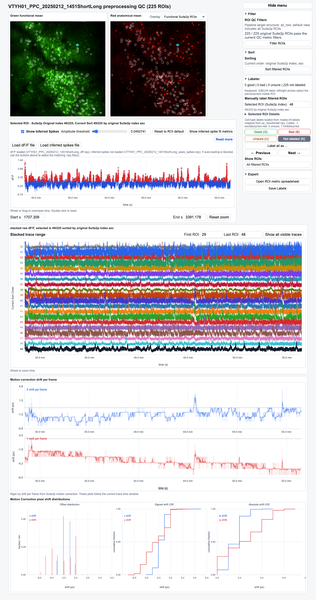

The reviewer is organized as a single interactive workspace that combines
image-based ROI inspection, trace review, filtering, labeling, and export. The
top of the layout contains the **FOV image** with Suite2p ROI outlines overlaid;
when anatomical imaging is available, a **red-channel panel** is shown beside
the green functional image. The currently selected ROI is highlighted in cyan so
it can be matched across the image, selected trace, and stacked trace panels.

The right-side menu contains the major reviewer controls: **Filter**, **Sort**,
**Labeler**, and **Export**. Below the image area, the reviewer shows the
single-ROI dF/F trace, the stacked trace panel, the inferred-spike overlay and
diagnostic controls when those data are available, and motion-correction plots.
The following sections describe each component in more detail.

### 2. FOV ROI selection

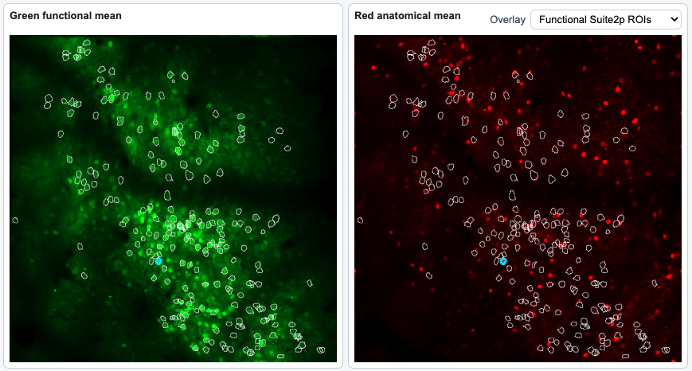

The **FOV ROI selection** panel shows the green functional mean image and, when
available, an optional red-channel anatomical panel. Clickable outlines on the
green functional image correspond to the ROI masks detected by Suite2p. The
selected ROI outline is emphasized in cyan, providing a spatial reference for
the trace and metric information elsewhere in the reviewer.

When filters are applied, ROI masks that do not pass the active filter are
removed from the FOV panel. They can be viewed again by clearing filters or
using the control to show all ROIs. This makes the FOV panel a direct visual
representation of the current filtered ROI population.

Scroll and drag interactions support **zooming** and **panning** around dense ROI
fields. When anatomical masks are present from a Cellpose run in `masks.h5`,
they can be viewed on the anatomical mean image with the **Overlay** dropdown.
Those anatomical masks are displayed for spatial comparison but are not
selectable in the current reviewer, which supports one selected mask and dF/F
trace file at a time.


### 3. Manual label controls

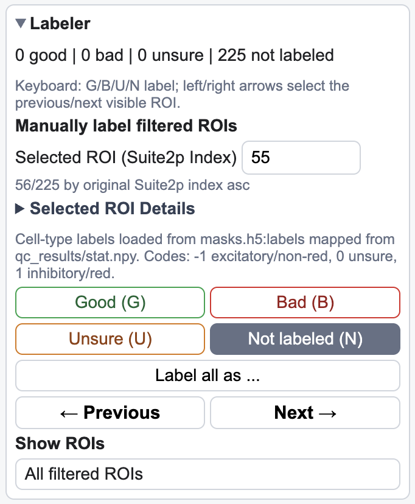

The **manual label controls** assign the current ROI to one of four reviewer
states: **Good**, **Bad**, **Unsure**, or **Not labeled**. The button
corresponding to the current ROI's label is filled with color, and the keyboard
shortcuts `G`, `B`, `U`, and `N` provide faster entry for repeated review.

The label counts summarize all ROIs in the session, not only the ROIs currently
passing filters. When filters are applied, failing ROIs are automatically
labeled **Bad** and are not visible or selectable in the filtered view, but they
are still included in the Bad count. Reviewers can still manually revise labels
after filters have been applied.

The **Previous** and **Next** controls, along with the left and right arrow
keys, move through ROIs in the current sort order. Only ROIs that pass the
active filters are included in this navigation set. The default ordering is the
ascending Suite2p ROI index, or row order when a non-Suite2p input layout is
used, and the default label for passing ROIs is **Not labeled**. The **Selected
ROI index** identifies the ROI within the session and persists across sorting
operations, while the displayed position indicates where that ROI falls in the
current sort order. **Selected ROI Details** can be expanded to show morphology,
dF/F, and inferred-spike summary metrics, and **Label all as ...** supports bulk
labeling of multiple visible ROIs.

### 4. Show ROIs by label

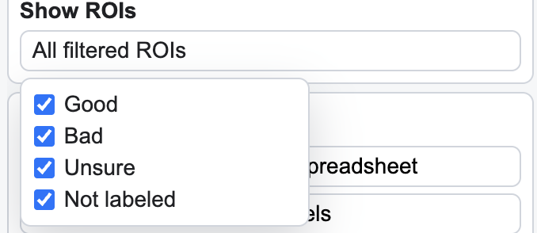

The **Show ROIs** controls toggle visibility for **Good**, **Bad**, **Unsure**,
and **Not labeled** ROIs. These display controls change what appears in the
reviewer and which ROIs are included in navigation, but they do not change saved
manual labels.

This visibility setting operates after the active QC filters. ROIs excluded by
the filter are automatically labeled **Bad**, but they are not visible or
selectable simply because Bad ROIs are enabled in the Show ROIs menu. To view
filtered-out ROIs, the relevant QC filter must be removed or reset.

### 5. ROI QC filters

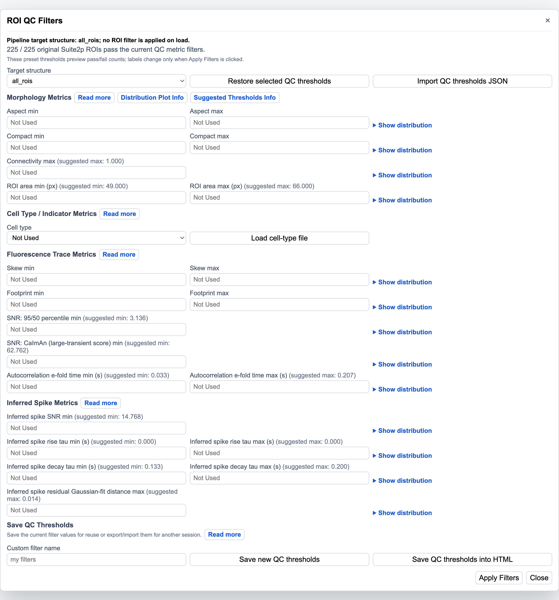

The **ROI QC Filters** menu previews which ROIs pass the active QC thresholds.
By default, no thresholds are active and all ROIs pass. Editing a threshold
field immediately updates the pass/fail count and the visible ROI set, but it
does not change manual labels until **Apply Filters** is clicked. Empty
threshold fields are treated as unused filters.

The **Target structure** dropdown loads built-in QC threshold presets, such as
all ROIs, soma, dendrite, or other presets that are embedded in the generated
HTML or imported by the reviewer. **Restore selected QC thresholds** reloads
the currently selected preset and discards unsaved edits in the threshold
fields. Custom saved threshold sets also appear in this dropdown under their
saved names.

The filter menu is organized into three main metric categories. **Morphology
metrics** describe ROI shape and mask quality, and are intended to identify
implausible shapes, fragmented masks, unusually small or large footprints, or
morphology values outside the chosen target-structure preset. **Fluorescence
trace metrics** are computed from each ROI's dF/F trace and are intended to
identify weak trace structure, trace-quality values outside the expected range,
or fluorescence dynamics that do not fit the target ROI class. **Inferred spike
metrics** are computed from OASIS-style inferred-spike outputs when available
and describe whether inferred events have reasonable amplitude, timing, and
residual structure relative to the dF/F trace. If inferred-spike outputs are not
available for a session, those controls may be disabled or marked as
unavailable.

The **Read more** controls document where each metric category comes from and
how the reviewer interprets the values. **Distribution** controls reveal
per-metric histograms so threshold choices can be compared with the full ROI
population. Suggested thresholds are derived from the ROIs embedded in the
current reviewer HTML, making them session-specific starting points rather than
fixed lab rules.

Filtering is conjunctive: each ROI must pass every active threshold to pass the
current QC filter. **Min** fields require the ROI metric to be greater than or
equal to the entered value, and **Max** fields require the ROI metric to be less
than or equal to the entered value. ROIs with missing or non-finite values fail
active thresholds that depend on those values. The menu reports the number of
original Suite2p ROIs that pass the active filter.

The **Apply Filters** button converts the current pass/fail result into manual
labels. Passing ROIs are set to **Not labeled**, while failing ROIs are set to
**Bad**. This action is intentionally separate from threshold editing so
reviewers can preview filters before changing labels. After filters are applied,
manual labels remain separately editable, and reviewers can still change
individual ROIs to Good, Bad, Unsure, or Not labeled. Exported label files
preserve the final manual label state, not just the filter result.

#### 5.1. Metric distributions and suggested thresholds

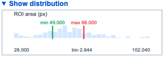

**Distribution histograms** are available for individual metrics in the filter
menu. For fields without suggested thresholds, the plot marks the mean value.
For fields with suggested thresholds, the marked values are usually derived from
percentiles or related distribution summaries; the **Suggest thresholds info**
and **Read more** panels describe the metric source and the suggested-threshold
semantics.

The vertical threshold markers update as min and max fields are edited, making
the histogram a direct preview of how a threshold relates to the full ROI
population. Suggested thresholds are computed from the ROIs embedded in the
current reviewer HTML, so they should be treated as session-specific guidance
rather than fixed exclusion rules.

#### 5.2. Saving and reusing QC thresholds

**Save new QC thresholds** adds the active threshold settings as a named filter
within the current browser session. **Save QC thresholds into HTML** downloads a
reviewer copy of the full HTML labeler with any saved threshold sets from the
current session embedded in the file. This is the appropriate option when a
reviewer needs to close the browser but later return to the same labeling state,
because ROI labels, QC thresholds, and other HTML session state do not
automatically modify the source file on disk.

**Export QC thresholds JSON** is available from the **Save Labels** dialog on
the main menu, and **Import QC thresholds JSON** loads filter settings in the
same format. This provides a lightweight way to reuse threshold sets across
sessions or include them in documentation and provenance records.

Example JSON matching the current built-in soma preset. In the code this preset is stored internally as `neuron` for historical compatibility, but the reviewer displays it as soma. It uses only morphology thresholds; fluorescence trace and inferred spike thresholds are intentionally omitted.

```json
{
  "name": "soma",
  "filter": {
    "skewMin": -5.0,
    "skewMax": 5.0,
    "maxConnect": 1,
    "aspectMin": 0.0,
    "aspectMax": 5.0,
    "footprintMin": 1.0,
    "footprintMax": 2.0,
    "compactMin": 0.0,
    "compactMax": 1.06
  }
}
```

Fields omitted from the `filter` object are treated as unused thresholds.

### 6. Sorting ROIs

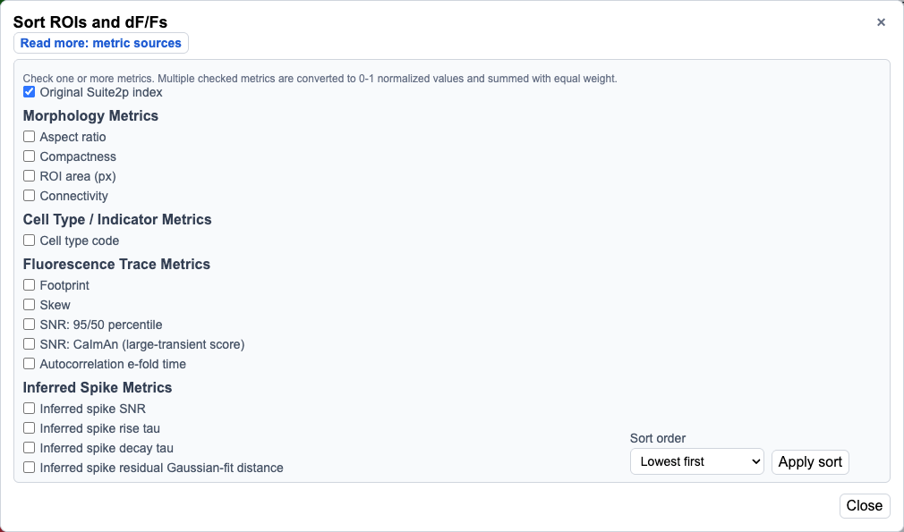

The **Sort ROIs** dialog orders ROIs by original Suite2p index, row order, or
metrics from the same categories used in the ROI QC filters: morphology,
fluorescence trace, and inferred-spike metrics. Sorting updates both the
selected ROI navigation order and the stacked trace order, making it useful for
reviewing ROIs with similar metric values together.

When multiple metrics are checked, each metric is normalized to a 0-1 range and
combined with equal weight into a single score across all ROIs. The sort order
can be set to lowest-first or highest-first for the final metric or combined
score.

When selecting multiple metrics, choose metrics whose direction has the same practical meaning. For example, a lower inferred-spike residual Gaussian-fit distance is generally better, so ascending order usually makes sense for that metric. A higher SNR is generally better, so descending order usually makes sense for SNR. Combining those two directly can be counterproductive because the current sorter does not automatically flip metric directions before combining them. Support may be added later for automatically coherent combinations of metrics with opposite preferred directions, but the current reviewer leaves that choice to the user.


### 7. Selected ROI dF/F and OASIS overlay

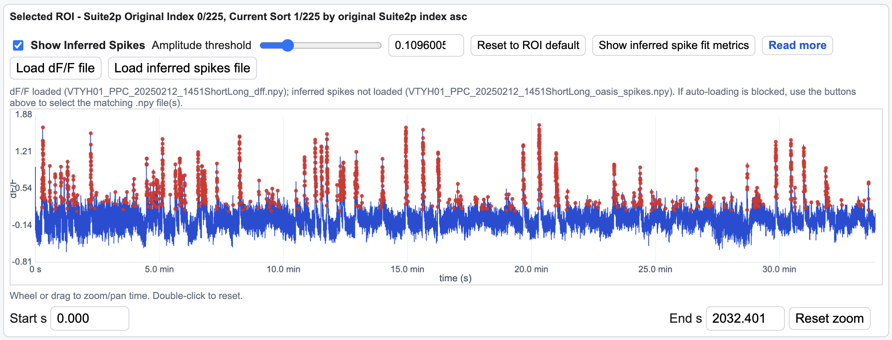

The **selected ROI dF/F trace** shows the fluorescence trace for the currently
selected ROI over the active time window. Wheel and drag interactions zoom or
pan through time, and double-clicking resets the view. This time window is
shared with other trace-linked panels, allowing the reviewer to inspect the same
period across the selected trace, stacked traces, and motion plots.

When inferred-spike data are available, **inferred spikes** can be toggled on or
off over the dF/F trace. The amplitude threshold slider and number input control
which inferred-spike amplitudes are displayed. **Reset to ROI default** restores
the precomputed ROI-specific threshold where the event-window residuals most
closely resemble Gaussian noise. The **Show inferred spike fit metrics** button
and section 8 provide more detail on how that threshold and its diagnostics are
interpreted.

#### 7.1. dF/F and inferred-spike input format

When the preprocessing summary is run on a processed Suite2p session directory,
the reviewer generates the dF/F and inferred-spike inputs automatically. Small
arrays are embedded directly in the HTML. Larger arrays are written beside the
HTML as `.npy` sidecar files and the browser tries to load them automatically
from the same folder. If browser security blocks that automatic load, use
**Load dF/F file** and **Load inferred spikes file** to select the matching
sidecar files manually.

The dF/F sidecar is generated by this repo's preprocessing summary from the
selected input layout: native Suite2p traces
`suite2p/plane0/F.npy` / `suite2p/plane0/Fneu.npy`, or filtered
`qc_results/fluo.npy` / `qc_results/neuropil.npy` style traces when that layout
is detected or selected explicitly. The neuropil coefficient is read from
`ops.npy`. The inferred-spikes sidecar is generated from the matching
`spikes.h5` when available. Those inferred-spike values may come from Suite2p's
OASIS deconvolution, but the reviewer expects the exported ROI-by-frame
amplitude array rather than a native Suite2p GUI file.

For either autogenerated sidecars or arrays from another upstream processing
workflow, the browser loader expects NumPy `.npy` files with this layout:

```text
shape = (n_rois, n_frames)

            frame 0   frame 1   frame 2   ...   frame N
ROI 0        value     value     value           value
ROI 1        value     value     value           value
ROI 2        value     value     value           value
...
ROI M        value     value     value           value
```

Rows are ROIs and columns are imaging frames. The ROI row order must match the
ROI order embedded in the reviewer, and the dF/F and inferred-spike arrays
should have the same shape and frame count.

The `.npy` arrays should be C-order, not Fortran-order. Practically, this means
each row stores one ROI's full time series in order:

```text
ROI 0 frame 0, ROI 0 frame 1, ROI 0 frame 2, ...
ROI 1 frame 0, ROI 1 frame 1, ROI 1 frame 2, ...
```

Most arrays written with `np.save()` already satisfy this. Force the expected
format before saving if the array came from transposing, slicing, MATLAB-style
processing, or HDF5 conversion. The browser supports little-endian `float32`
and `float64`; `float64` is converted to `float32` after loading.

```python
import numpy as np

dff = np.ascontiguousarray(dff, dtype=np.float32)
spikes = np.ascontiguousarray(spikes, dtype=np.float32)

np.save("session_dff.npy", dff)
np.save("session_inferred_spikes.npy", spikes)
```

### 8. Inferred spike diagnostics

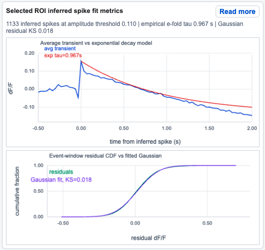

The inferred-spike diagnostics are viewer-side summaries of how the selected
ROI's dF/F trace behaves around frames where the inferred-spike amplitude is
above the active amplitude threshold. The current pipeline can generate those
amplitudes with Suite2p's OASIS deconvolution, but the diagnostics only require
an ROI-by-frame inferred-spike amplitude array. See the
[Suite2p deconvolution documentation](https://suite2p.readthedocs.io/en/latest/api/extraction/#suite2p.extraction.dcnv.oasis)
and the [OASIS paper](https://doi.org/10.1371/journal.pcbi.1005423) for
background on how Suite2p-style inferred-spike amplitudes are produced.

The **amplitude threshold** is a cutoff on the inferred-spike amplitude trace.
Frames with amplitudes above the threshold are treated as events for plotting
and metric calculation. For amplitudes, larger values mean the upstream deconvolution
assigned stronger spike-like activity to that frame.

The **event count** is the number of threshold-passing inferred-spike frames
used for the selected ROI diagnostics. For the selected-ROI diagnostic panel,
events must have enough surrounding frames to build a peri-event window and
events that occur within about 0.25 seconds of the previous accepted event are
skipped so overlapping transients do not dominate the average.

The **average transient** is the mean dF/F waveform around accepted events.
Each event window spans roughly 0.5 seconds before the event and 2 seconds
after the event. The viewer subtracts a local pre-event baseline from each
window before averaging, so the displayed curve is meant to show the typical
event-locked dF/F shape for the selected ROI and threshold.

The **exponential tau** shown in the selected-ROI panel is an empirical decay
time constant for the average transient. The viewer finds the peak of the
average transient after the event, estimates the transient amplitude, and then
reports the time from that peak until the curve has decayed to about `1/e` of
that amplitude. This is the same practical idea as an exponential e-folding
time constant, where a simple decay has the form:

```text
amplitude(t) = amplitude_at_peak * exp(-time_since_peak / tau)
```

This tau is a descriptive fit diagnostic for the selected ROI, not a re-run of
the OASIS deconvolution model. The inferred-spike filter metrics also include
rise and decay tau values calculated from event-triggered dF/F windows: rise
tau is the time between crossing 10% and 90% of the average event amplitude,
and decay tau is the time from the average event peak until the transient falls
to `1/e` of that amplitude.

The **inferred-spike SNR** is calculated from the average event-triggered dF/F
waveform. It is the event amplitude divided by the standard deviation of the
pre-event baseline in the average event window. Higher values indicate events
that stand out more clearly from the pre-event baseline.

The **residual dF/F** values are local deviations of the dF/F trace around
threshold-passing events. Around each event frame, the viewer marks a small
event window and compares each marked dF/F sample with a local moving average.
Those differences form the residual distribution shown in the lower diagnostic
plot.

The **Gaussian fit, KS** value summarizes how close the event-window residuals
are to a fitted Gaussian distribution. The viewer fits the Gaussian using the
residual mean and standard deviation, builds the empirical cumulative
distribution of the residuals, and reports the largest vertical distance
between the empirical CDF and fitted Gaussian CDF. This is a
[Kolmogorov-Smirnov distance](https://docs.scipy.org/doc/scipy/reference/generated/scipy.stats.kstest.html)-style
goodness-of-fit statistic. Lower values mean the residual distribution is
closer to Gaussian under this simple check; higher values indicate heavier
tails, skew, artifacts, overlapping events, or other structure left in the
event-window residuals.

The **Reset to ROI default** threshold uses a precomputed per-ROI threshold
chosen from candidate inferred-spike amplitude cutoffs. For each candidate, the
summary code calculates event-window residuals and the Gaussian KS distance.
The default is the candidate threshold with the smallest finite residual
Gaussian-fit distance. This makes the default a data-driven display/QC
threshold, not a claim that the chosen events are all true spikes.

The current diagnostics make several practical assumptions. Inferred-spike
inputs are treated as nonnegative event amplitudes from OASIS or a compatible
upstream method, with larger values representing stronger inferred spike-like
activity. Event-triggered dF/F responses are assumed to be meaningfully
alignable across events for the same ROI, so averaging them produces an
interpretable transient shape. The decay summary assumes that the average event
response has a positive peak and approximately monotonic decay after that peak;
strongly multiphasic, overlapping, saturated, or motion-contaminated events can
therefore make tau values misleading. The Gaussian residual metric assumes that,
after local event structure is removed, residual deviations around events should
look roughly Gaussian. KS distance also depends on the number and distribution
of residual samples, so sessions or ROIs with very few usable events may have
missing or unstable diagnostics.

### 9. Stacked dF/F traces

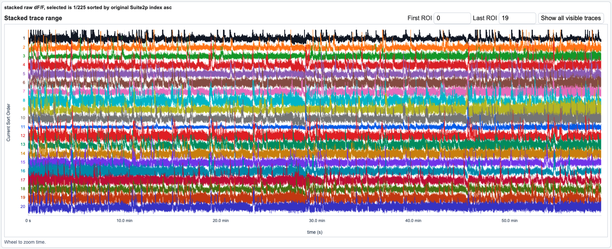

The stacked trace panel is a compact view of many ROI dF/F traces at once. It
uses the current visible ROI list, so filtering, hiding labels, and sorting all
change which traces appear and the order in which they are drawn. This makes it
useful for checking whether a filter or sort produced a coherent group of ROIs
before applying bulk labels or exporting results.

Each horizontal row corresponds to one visible ROI in the current sort order.
The plotted signal is the ROI's dF/F trace over the active time window. The
selected ROI is highlighted so it can be matched to the selected FOV outline and
the larger single-ROI dF/F panel above. Clicking or stepping through ROIs updates
the selected row, while changing filters or sort order can move the same ROI to
a different row or remove it from the visible set.

The **First ROI** and **Last ROI** controls choose the visible row range within
the current filtered/sorted list, not original Suite2p ROI numbers. For example,
if a filter leaves 200 ROIs visible, setting First ROI to `0` and Last ROI to
`49` shows the first 50 ROIs in that filtered/sorted ordering. **Show all
visible traces** expands the stacked panel back to the full visible set after a
manual row range has been applied.

The time axis is shared with the selected ROI trace and motion plots. Scrolling
or dragging over the trace panels changes the active time window, and
double-clicking resets the time view. This allows the stacked trace panel to be
used both as a broad session scan and as a zoomed inspection view around a
specific time period.

When inferred spikes are loaded, the stacked trace panel still draws dF/F traces
rather than spike amplitudes. Use the selected ROI trace for the inferred-spike
overlay and the inferred-spike diagnostics panel for threshold-specific event
summaries. The stacked panel is mainly intended for visual comparison of trace
shape, activity level, artifacts, and consistency across the currently visible
ROI subset.

### 10. Motion correction plots

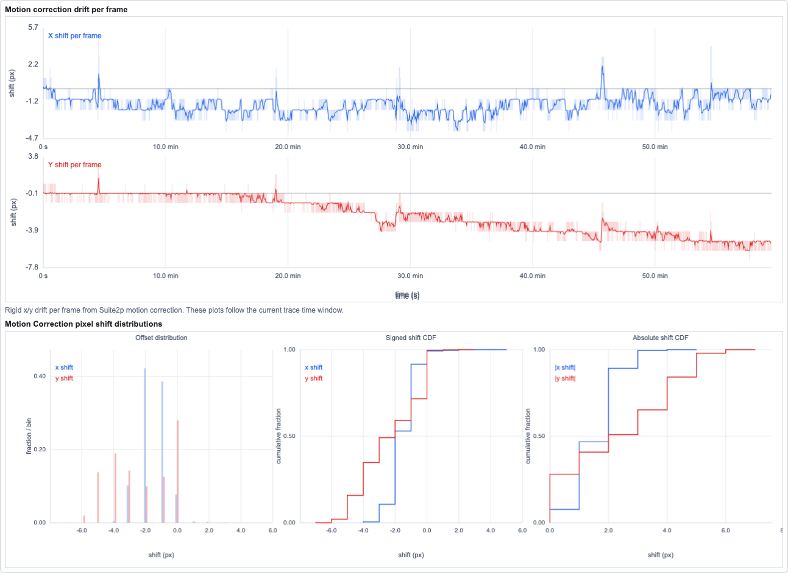

The motion correction area summarizes rigid frame shifts from the preprocessing
stage. These plots are meant to help reviewers identify sessions or time ranges
with large drift, abrupt registration jumps, or directional bias that could
affect ROI traces and labels.

The **drift plot** has two stacked time-series panels. The top panel shows x
shift per frame and the bottom panel shows y shift per frame, both in pixels.
Positive and negative values indicate the direction of the rigid correction
relative to the registered reference frame. The horizontal zero line marks no
shift. The drift plot follows the same active time window as the selected ROI
trace and stacked dF/F traces, so zooming or panning the trace time axis also
updates the visible motion-correction time range.

The **motion distribution plot** summarizes the full-session motion offsets,
not just the current zoomed time range. It contains three side-by-side panels.
The **Offset distribution** shows the fraction of frames in each signed x/y
shift bin, which helps reveal whether motion is tightly centered near zero or
spread broadly across many pixel shifts. The **Signed shift CDF** shows the
cumulative fraction of x/y shifts less than or equal to each signed shift value,
making directional bias easier to see. The **Absolute shift CDF** shows the
cumulative fraction of absolute x/y shifts and is useful for estimating what
fraction of frames stayed within a given registration magnitude regardless of
direction.

The controls are shared with the trace viewer. Use the mouse wheel on the drift
plot to zoom the active time window, drag horizontally to pan through time, and
double-click to reset the time window. The distribution plot does not have a
separate time-window control because it is intended as a full-session summary.

The expected motion inputs are one-dimensional x/y offset arrays with one value
per imaging frame:

```text
shape = (n_frames,)

frame       0      1      2      ...      N
xoff      px     px     px               px
yoff      px     px     px               px
```

The summary generator first looks for a session-level `move_offset.h5` file
with datasets named `xoff` and `yoff`:

```text
/path/to/processed/session/
└── move_offset.h5
    ├── xoff    # one-dimensional x shift array, pixels
    └── yoff    # one-dimensional y shift array, pixels
```

If `move_offset.h5` is not present, it falls back to `xoff` and `yoff` stored in
Suite2p's `ops.npy`:

```text
/path/to/processed/session/
└── suite2p/
    └── plane0/
        └── ops.npy    # contains keys "xoff" and "yoff"
```

The arrays should be numeric and in frame order. If
`xoff` and `yoff` have different lengths, the interactive viewer uses the shared
overlap with the available dF/F frame count. If no valid offsets are found, the
motion panels remain visible but report that motion offsets are not available
for the session.

### 11. Bulk labeling

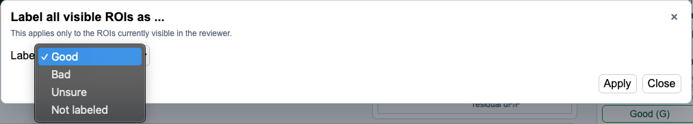

The **Label all visible ROIs as ...** dialog applies one manual label to the
currently visible ROI set. Available bulk labels are **Good**, **Bad**,
**Unsure**, and **Not labeled**. Because the action only affects visible ROIs,
it is most useful after applying QC filters, changing the Show ROIs visibility
settings, or sorting and restricting the displayed ROI range.

Bulk labeling is intended as a review accelerator rather than a replacement for
manual inspection. After applying a bulk label, individual ROIs can still be
revisited and assigned a different label.

### 12. Export and save options

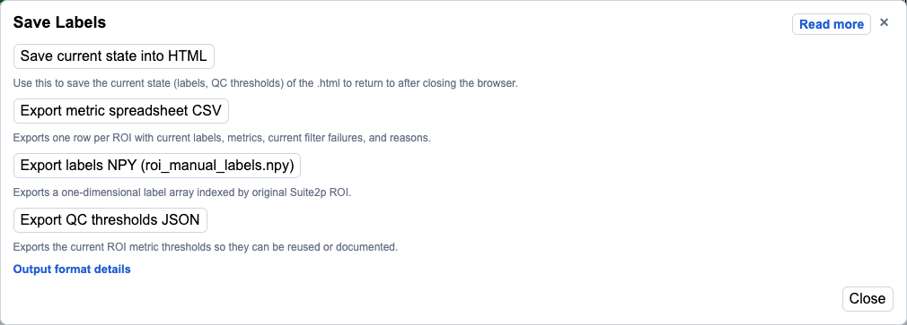

The **Export** section and **Save Labels** dialog provide the main ways to
preserve reviewer state and move results into downstream analysis. **Save
current state into HTML** writes a self-contained reviewer copy that preserves
current labels and custom filters. **Export metric spreadsheet CSV** writes one
row per ROI with labels, metrics, filter failures, and exclusion reasons.
**Export labels NPY** writes `roi_manual_labels.npy`, and **Export QC thresholds
JSON** saves the active metric thresholds for reuse or documentation.

#### 12.1. Open ROI metric spreadsheet

**Open ROI metric spreadsheet** opens a browser table with one row per ROI. It
is a review and audit view of the same ROI metrics used by the filtering and
sorting controls, plus the current manual label state. The table includes the
original Suite2p ROI index, manual label, optional cell-type label, morphology
metrics, fluorescence trace metrics, inferred-spike metrics when available, and
a reason column summarizing why the ROI is included or which active thresholds
or labels currently mark it as failing.

The spreadsheet is generated from the current reviewer state at the moment the
button is clicked. If you label ROIs as Good, Bad, Unsure, or Not labeled, those
labels appear in the spreadsheet immediately when it is opened again. Active QC
thresholds also affect the failure highlighting and reason text, so the
spreadsheet is useful for checking exactly what the current filter settings are
doing before saving labels or exporting thresholds.

The opened spreadsheet includes a **Download CSV** button. This produces the
same metric-spreadsheet CSV available from the **Save Labels** dialog under
**Export metric spreadsheet CSV**. The CSV is useful when you want a static copy
of the table for analysis, review notes, or provenance.

Current exported fields:

| Column | Type | Description |
| --- | --- | --- |
| `suite2p_index` | integer | Original Suite2p ROI index for this row. |
| `manual_label` | string | Current manual label: `good`, `bad`, `unsure`, or `not labeled`. |
| `cell_type_label` | string | Optional cell-type or indicator label when available; otherwise unset/unknown. |
| `cell_type_code` | nullable integer | Numeric cell-type code when available. Blank in the CSV when unavailable. |
| `footprint` | float | Fluorescence footprint metric used by QC filters. |
| `skew` | float | Fluorescence trace skew metric used by QC filters. |
| `aspect_ratio` | float | Morphology aspect-ratio metric. |
| `compact` | float | Morphology compactness metric. |
| `connectivity` | integer | Morphology connectivity/component count. |
| `roi_area_px` | float | ROI area in pixels. |
| `snr_95_50` | float | Fluorescence trace SNR based on high-percentile versus median signal. |
| `caiman_exceptional_event_snr` | float | CaImAn-style large-transient SNR metric. |
| `autocorr_efold_time_seconds` | float | Fluorescence autocorrelation e-fold time in seconds. |
| `inferred_spike_snr` | nullable float | Event-triggered inferred-spike SNR when inferred spikes are available. |
| `inferred_spike_rise_tau_seconds` | nullable float | Inferred-spike event rise time metric in seconds. |
| `inferred_spike_decay_tau_seconds` | nullable float | Inferred-spike event decay/e-fold metric in seconds. |
| `inferred_spike_residual_gaussian_ks` | nullable float | Gaussian-fit KS distance for event-window residuals. Lower is closer to Gaussian. |
| `reason` | string | Semicolon-separated inclusion/failure notes from the current labels and active thresholds. |

The CSV file is plain text, so downstream tools may infer dtypes differently.
When loading with pandas, treat blank numeric entries as missing values and cast
label columns as strings or categoricals.

This spreadsheet does not by itself save manual labels back into the reviewer
HTML or write `roi_manual_labels.npy`. It only displays and optionally exports a
CSV snapshot of the current state. To preserve label edits after closing the
browser, use **Save Labels**. **Save current state into HTML** writes a reviewed
HTML copy that keeps the current labels and custom filters embedded in the file.
**Export labels NPY** writes `roi_manual_labels.npy`, the one-dimensional label
array used by downstream code. **Export metric spreadsheet CSV** writes the
spreadsheet snapshot with the same current labels, metrics, filter failures, and
reasons.

## Generate the labeler and summary

The summary stage creates:

```text
<session>_preprocessing_summary.pdf
<session>_interactive_fov_roi_dff.html
```

Run the commands below from the `2p_imaging` repository root with the
preprocessing QC environment available. The first positional argument can be a
processed session root or a concrete data directory, such as `suite2p/plane0`,
`suite2p/`, `qc_results/`, `manual_qc_results/`, or a directory containing
external ROI masks and fluorescence traces.

### Required processed-session files

At minimum, the processed session must contain:

```text
/path/to/processed/session/
└── suite2p/
    └── plane0/
        ├── ops.npy
        ├── stat.npy
        ├── F.npy
        └── Fneu.npy
```

`ops.npy` must contain the functional mean image produced by Suite2p. An
existing `iscell.npy` is used when present for provenance, but the reviewer
opens with all Suite2p ROIs available and not labeled.

The summary generator can also read filtered `qc_results`-style outputs. When a
session root is supplied in auto-detect mode, it uses `qc_results/` first when
the following files are present, then `manual_qc_results/`, then native
`suite2p/plane0/`, and finally an external-ROI layout if one is present at the
session root:

```text
/path/to/processed/session/
└── qc_results/
    ├── stat.npy       # filtered equivalent of suite2p/plane0/stat.npy
    ├── fluo.npy       # filtered equivalent of suite2p/plane0/F.npy
    ├── neuropil.npy   # filtered equivalent of suite2p/plane0/Fneu.npy
    └── iscell.npy     # optional
```

Use `--input-layout suite2p`, `--input-layout qc_results`,
`--input-layout manual_qc_results`, or `--input-layout external_rois` to make
the expected directory structure explicit. The command prints which layout it
uses and the resolved paths for stat or ROI geometry, fluorescence, neuropil,
optional `iscell.npy`, and inferred spikes.

### Direct input directories and layout detection

The generator now accepts a concrete input directory directly, which can be
clearer than always pointing to the session root. These calls are equivalent
when the corresponding files exist:

```bash
python -m utils_2p.preprocessing_summary /path/to/session
python -m utils_2p.preprocessing_summary /path/to/session/suite2p
python -m utils_2p.preprocessing_summary /path/to/session/suite2p/plane0
python -m utils_2p.preprocessing_summary /path/to/session/qc_results
python -m utils_2p.preprocessing_summary /path/to/session/manual_qc_results
```

When the argument already points to a concrete layout directory, that directory
is used directly instead of searching the session root. For example,
`/path/to/session/qc_results` is interpreted as a filtered-output layout, while
`/path/to/session/suite2p/plane0` is interpreted as native Suite2p output. The
default output directory is the resolved session root unless `--output-dir` is
provided.

### External ROI masks from non-Suite2p tools

The reviewer does not require ROIs to be detected by Suite2p. It requires a
consistent ROI geometry and trace representation:

```text
ROI row i -> pixels/weights in the displayed FOV coordinate frame
ROI row i -> fluorescence trace row i
```

The summary generator can convert external ROI masks into the Suite2p-like
`stat.npy` representation used internally by the HTML viewer. Point the summary
command at a directory with one ROI geometry file and matching traces:

```text
/path/to/external_roi_session/
├── roi_mask.npy                 # dense integer label image, optional
├── spatial_components.npz       # sparse pixels x rois matrix, optional
├── F.npy or fluo.npy            # raw fluorescence, shape (n_rois, n_frames)
├── Fneu.npy or neuropil.npy     # optional neuropil, shape (n_rois, n_frames)
├── mean_func.npy                # optional FOV image, shape (Ly, Lx)
└── external_roi_metadata.json   # optional, mainly for sparse matrices
```

Use exactly one of these geometry inputs:

| File | Expected format |
| --- | --- |
| `roi_mask.npy`, `roi_masks.npy`, `label_mask.npy`, or `masks.npy` | Dense 2-D integer image. `0` is background. Positive labels are ROIs. |
| `spatial_components.npz`, `roi_spatial_components.npz`, or `A.npz` | SciPy sparse matrix with shape `(pixels, n_rois)` or `(n_rois, pixels)`. Each column/row is a weighted ROI footprint. |
| `stat.npy` | Already-normalized Suite2p-like object array with `ypix`, `xpix`, and optional `lam`. |

For dense label masks, positive labels are converted in ascending label order.
For example, label value `1` becomes ROI row `0`, label value `2` becomes ROI
row `1`, and so on. The row order must match the row order in `F.npy`.

For sparse matrices, supply the FOV shape if no functional image file is
present:

```json
{
  "image_shape": [512, 512],
  "flatten_order": "F"
}
```

`flatten_order` controls how flattened pixel indices are mapped back to
`(y, x)` coordinates. CaImAn-style spatial matrices commonly use Fortran order
(`"F"`), which is the default. Use `"C"` if the matrix was flattened in normal
NumPy row-major order.

The functional FOV image can be supplied as `mean_func.npy`, `meanImg.npy`,
`mean_green.npy`, or `functional_mean.npy`. Optional maximum-projection and
anatomical images can also be supplied with names such as `max_func.npy`,
`max_proj.npy`, `mean_anat.npy`, or `mean_red.npy`. If no FOV image is supplied
for a dense ROI mask, the summary uses the ROI mask extents to create a blank
background. That is enough to inspect masks and traces, but a real functional
mean image is strongly preferred because it verifies that the ROI coordinates
are in the same frame as the imaging data.

Example dense-mask input:

```python
import numpy as np

roi_mask = np.zeros((512, 512), dtype=np.int32)
roi_mask[100:110, 200:230] = 1
roi_mask[250:270, 300:315] = 2

F = np.random.rand(2, 12000).astype("float32")
Fneu = np.zeros_like(F)
mean_func = np.random.rand(512, 512).astype("float32")

np.save("roi_mask.npy", roi_mask)
np.save("F.npy", F)
np.save("Fneu.npy", Fneu)
np.save("mean_func.npy", mean_func)
```

Generate the viewer:

```bash
python -m utils_2p.preprocessing_summary \
  /path/to/external_roi_session \
  --input-layout external_rois
```

If the directory is already complete, `--input-layout external_rois` is optional
because the generator can auto-detect the external-ROI layout from the concrete
input directory. If `Fneu.npy` or `neuropil.npy` is omitted, the summary
generator treats neuropil as zero.

### Metrics calculated for external masks

When an external mask is converted, the summary pipeline fills the same
morphology-style fields that the reviewer uses for Suite2p ROIs:

| Metric | Source for external ROIs |
| --- | --- |
| `roi_area_px` / `npix` | Number of pixels assigned to the ROI. |
| `connectivity` | Number of 4-connected components in the ROI mask. |
| `aspect_ratio` | Bounding-box elongation: longer side divided by shorter side. |
| `compact` | Perimeter-based compactness: `perimeter² / (4π × area)`. |
| `footprint` | Fraction of the ROI bounding box occupied by ROI pixels. |
| `skew` | Skewness of the corresponding raw fluorescence trace row. |

These fallback values make non-Suite2p ROIs sortable and filterable in the same
viewer menus. They are compatible review metrics, not exact reproductions of
Suite2p's internal definitions for fields such as `compact` or `footprint`.
When a real `stat.npy` already contains Suite2p-derived values, those values
are preserved.

To make the pipeline's morphology QC target-structure presets available in the
viewer, the session should also contain:

```text
/path/to/processed/session/
├── preprocessing_pipeline_parameters.json
└── qc_results/
    └── qc_parameters.json
```

Without these morphology QC files, the summary can still be generated from the
Suite2p files, but the target-structure preset metadata will be unavailable.
`masks.h5` is optional and supplies anatomical images when available.

### Optional cell-type or indicator labels

The reviewer can display, filter, sort, and export optional cell-type or
indicator labels. These are separate from manual ROI QC labels. They are meant
for labels such as red/inhibitory versus non-red/excitatory status, or an
equivalent binary indicator classification from upstream processing.

When generating the summary, the script looks for precomputed cell-type labels
in this order:

```text
/path/to/processed/session/
├── suite2p/
│   └── plane0/
│       └── roi_cell_type_labels.npy
├── roi_cell_type_labels.npy
└── masks.h5    # optional dataset named "labels"
```

The preferred file is `roi_cell_type_labels.npy`. It should be a one-dimensional
NumPy array with one value per original Suite2p ROI:

```text
shape = (n_rois,)

ROI index      0      1      2      ...      M
label code    -1      1    NaN               0
```

Supported values are:

| Value | Meaning in reviewer |
| --- | --- |
| `1` | inhibitory/red |
| `-1` | excitatory/non-red |
| `0` | unsure |
| `NaN` | not loaded / unavailable for that ROI |

Example:

```python
import numpy as np

cell_type_labels = np.full(n_rois, np.nan, dtype=np.float32)
cell_type_labels[red_roi_indices] = 1
cell_type_labels[non_red_roi_indices] = -1
cell_type_labels[uncertain_roi_indices] = 0

np.save("roi_cell_type_labels.npy", cell_type_labels)
```

If labels are stored in `masks.h5` as a dataset named `labels`, the dataset must
contain the same `-1`, `0`, `1`, or `NaN` coding. When its length matches the
current ROI count, labels are used directly. When the labels appear to be
indexed to `qc_results/stat.npy`, the summary tries to map them back to the
original Suite2p ROI order.

Cell-type labels can also be loaded after the HTML is open by using the
**Upload cell-type labels** control in the ROI QC filters menu. The upload file
can be CSV, TSV, or plain text with a delimited table. It must contain a header
row and these columns:

```text
cell_type_code,cell_type_label
```

It may also contain one of these index columns:

```text
suite2p_index
roi
index
```

When an index column is present, rows are mapped by original Suite2p ROI index.
When no index column is present, row order is used and the file must contain
exactly one data row per ROI in the reviewer. `cell_type_code` accepts `-1`,
`0`, or `1`. `cell_type_label` accepts equivalent text labels such as
`excitatory`, `excitatory/non-red`, `non-red`, `exc`, `inhibitory`,
`inhibitory/red`, `red`, `inh`, `unsure`, `uncertain`, or `unknown`.

Example indexed CSV:

```csv
suite2p_index,cell_type_code,cell_type_label
0,1,inhibitory/red
1,-1,excitatory/non-red
2,0,unsure
3,,unknown
```

Uploaded cell-type labels update the current browser session immediately and
are included in the ROI metric spreadsheet. To preserve them in a reviewed HTML
copy, use **Save Labels** and then **Save current state into HTML** after
uploading.

### Generate locally

```bash
python -m utils_2p.preprocessing_summary /path/to/processed/session
```

The PDF and interactive HTML are written into the processed session directory.

To force a specific input layout:

```bash
python -m utils_2p.preprocessing_summary \
  /path/to/processed/session \
  --input-layout qc_results
```

### Generate on PACE

Submit summary generation as a small CPU job instead of running it on a PACE
login node:

```bash
export TWO_P_PYTHON=/storage/project/r-fnajafi3-0/grubin6/shared_envs/2p_preprocessing_qc_suite2p_1x/bin/python

sbatch \
  --account=gts-fnajafi3 \
  --qos=embers \
  --cpus-per-task=4 \
  --mem=24G \
  --time=02:00:00 \
  --job-name=preprocessing_summary \
  --wrap="$TWO_P_PYTHON -m utils_2p.preprocessing_summary /path/to/processed/session"
```

### Generate as part of the preprocessing pipeline

The full PACE preprocessing pipeline includes the `summary` stage by default:

```bash
python -m utils_2p.preprocessing_qc_pipeline submit \
  --session /path/to/raw/session \
  --output-root /path/to/processed_outputs \
  --target-structure neuron
```

Change `--target-structure` to the appropriate preset, such as `dendrite` or
`cerebellum_lax`.

To regenerate only the summaries for an existing pipeline output:

```bash
python -m utils_2p.preprocessing_qc_pipeline submit \
  --session /path/to/raw/session \
  --output-root /path/to/existing_processed_outputs \
  --target-structure neuron \
  --stages summary
```

The processed session must be located at
`/path/to/existing_processed_outputs/<raw-session-directory-name>/`.

## Export format and downstream use

The interactive HTML contains the original Suite2p ROI set. By default, every
Suite2p ROI opens as **not labeled**, and no morphology/QC filter is applied.
The preprocessing pipeline's target structure is still shown, and the built-in
`neuron`, `dendrite`, and `cerebellum_lax` filters remain available for manual
testing in the viewer.

The reviewer can label ROIs manually, apply a morphology/custom metric filter,
or use **Label all as ... → Not labeled** to return every visible Suite2p ROI
to the not-labeled state.

```text
All ROIs detected by Suite2p
        |
        v
Optional morphology/custom metric filters
        |
        v
Manual Good / Bad / Unsure / Unlabeled review
        |
        v
reviewed HTML or roi_manual_labels.npy
```

The reviewer can save the current labels back into a self-contained reviewed
HTML copy with **Save labels into HTML**. Reopening that saved HTML restores the
labels embedded in the file. Use **Save roi_manual_labels.npy** when downstream
scripts need a portable ROI mask file.

Custom morphology presets use the same explicit-save model. **Save preset**
adds the current threshold values to the open page, **Save preset into HTML**
saves a reviewed HTML copy that will reopen with that custom preset available,
and **Export preset JSON** / **Import preset JSON** move a preset between
sessions.

### `roi_manual_labels.npy`

This file is a one-dimensional NumPy array with one value per original Suite2p
ROI. The row index is the original Suite2p ROI index before morphology or
manual filtering:

```python
array([
    1.0,     # Suite2p ROI 0: good
    0.0,     # Suite2p ROI 1: bad
    2.0,     # Suite2p ROI 2: unsure
    nan,     # Suite2p ROI 3: not labeled
])
```

Values are:

| Value | Meaning |
| --- | --- |
| `NaN` | not labeled |
| `0` | bad |
| `1` | good |
| `2` | unsure |

The number of rows must match the original Suite2p ROI count, so
`roi_manual_labels[i]` is always the manual label for original Suite2p ROI `i`.
The reviewer initializes every Suite2p ROI as not labeled, so values are `NaN`
unless the reviewer labels ROIs manually or applies labels from a filter.

Place the reviewed file beside the original Suite2p files:

```text
/path/to/session/
└── suite2p/
    └── plane0/
        ├── F.npy
        ├── Fneu.npy
        ├── iscell.npy
        └── roi_manual_labels.npy
```

### Load reviewed dF/F

With `roi_manual_labels.npy` in `suite2p/plane0/`, load manually reviewed Good
ROIs in a script or notebook:

```python
from utils_2p.roi_labels import load_reviewed_dff

session = load_reviewed_dff("/path/to/session")
dff = session["dff"]
roi_indices = session["roi_indices"]
```

`dff` has shape `(selected_rois, frames)`. `roi_indices` contains the
corresponding original Suite2p ROI indices.

To include Unsure ROIs with Good ROIs, use:

```python
session = load_reviewed_dff("/path/to/session", policy="good_or_unsure")
```

When `roi_manual_labels.npy` is stored elsewhere, pass its path:

```python
session = load_reviewed_dff(
    "/path/to/session",
    label_path="/path/to/roi_manual_labels.npy",
)
```

Use `policy="good_or_unsure"` to include Unsure ROIs with Good ROIs, or
`policy="not_bad"` to include Good, Unsure, and Not Labeled ROIs. The companion
notebook contains the same example:
[`utils_2p/roi_reviewer_exports.ipynb`](https://github.com/najafi-laboratory/2p_imaging/blob/main/utils_2p/roi_reviewer_exports.ipynb).
